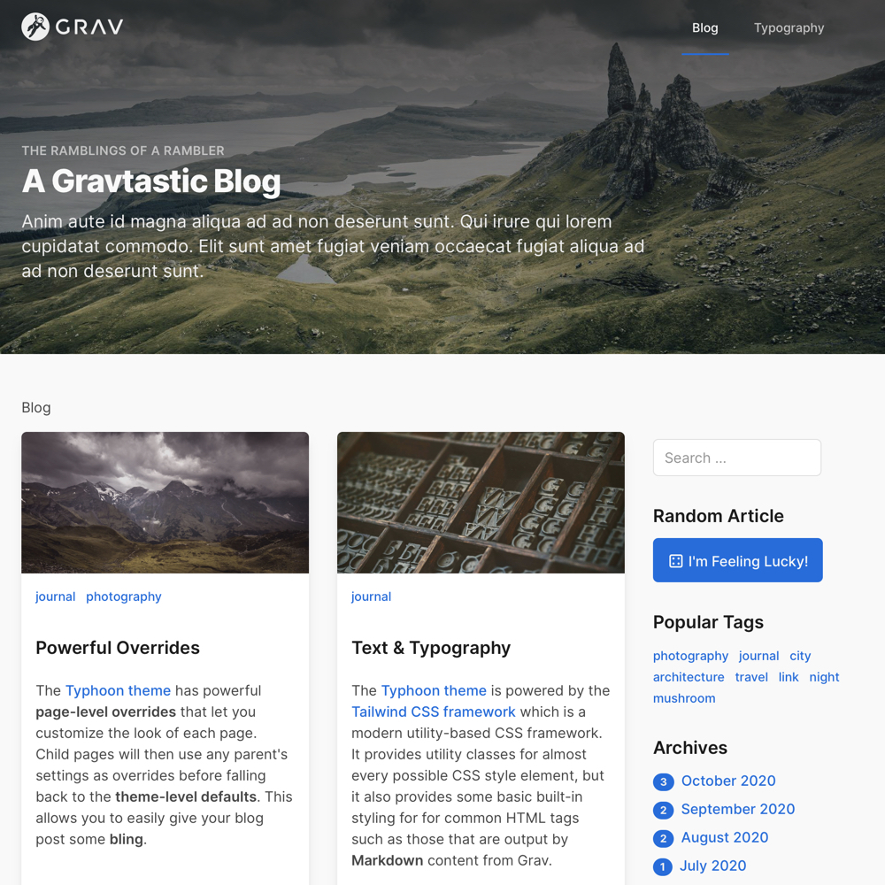
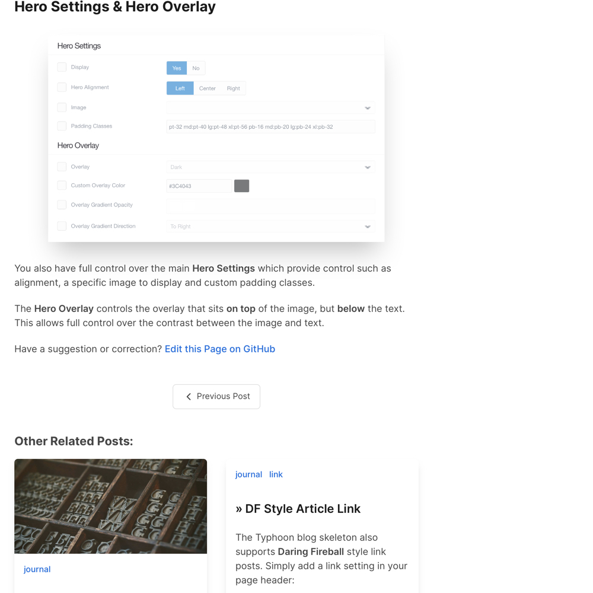

# Typhoon Blog Skeleton with Git Sync

This skeleton serves as a basic content skeleton, using an inherited Typhoon with Git Sync link theme, for demonstrating a simple **blog site** with the [Typhoon Grav Premium Theme](https://getgrav.org/premium/typhoon) - this skeleton does not include the Typhoon theme itself.

|Figure 1. Typhoon Blog Skeleton with Git Sync           |  Figure 2. Typhoon Blog Skeleton with Git Sync link
:-------------------------|:-------------------------|
|  |  |

## 🚀 Quick Install Instructions

**Pre-flight Checklist**  

1. Licensed Grav Premium Typhoon Theme
2. Web server login credentials (username and password)

**Installation Steps**  

1. Download the ready-to-run [Typhoon Blog with Git Sync](https://github.com/paulhibbitts/grav-skeleton-typhoon-blog-with-git-sync-site/archive/main.zip) (which does not include the Grav Premium Typhoon theme)
2. Unzip the package onto your desktop  
3. Copy the entire Typhoon Blog Skeleton with Git Sync folder to your Web server  
4. Point your browser to the Web server folder  
5. Create your site administrator account when prompted (Admin Panel is included)  
6. Go to the `License Manager` panel and import your `Typhoon` license
7. Go to the `Themes` panel, tap on `+Add` and install your now licensed `Typhoon` theme
8. Return to the `Themes` panel and choose the provided `MyTheme` inherited theme as your Active Theme
9. And that's it!

You can learn more about inherited themes at https://learn.getgrav.org/17/themes/customization#theme-inheritance
