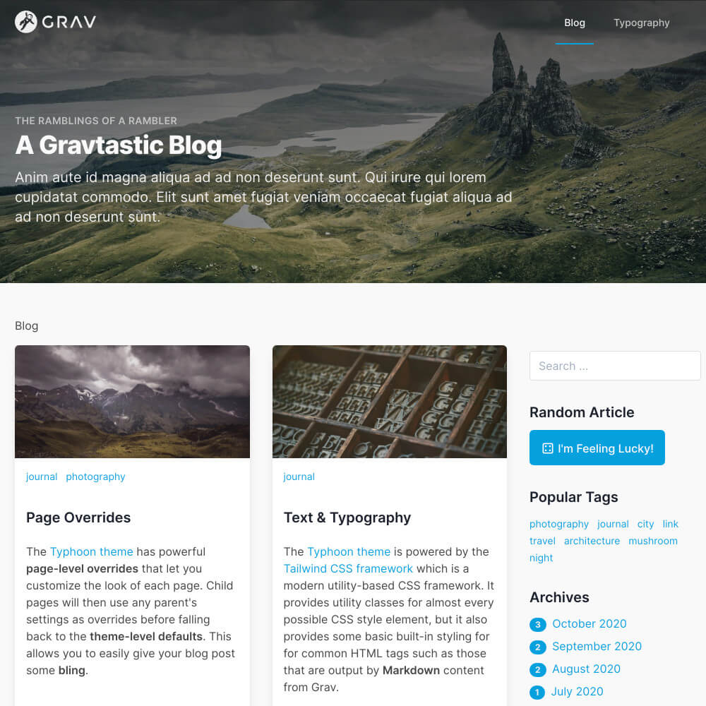

# Typhoon Blog Skeleton with Inherited Theme

This skeleton serves as a basic content skeleton, with an inherited Typhoon theme, for demonstrating a simple **blog site** with the [Typhoon Grav Premium Theme](https://getgrav.org/premium/typhoon) - this skeleton does not include the Typhoon theme itself.

## 🚀 Quick Install Instructions

1. Download and unzip the `grav-skeleton-inherited-typhoon-theme-blog-site.zip` Skeleton package and unzip it.

2. View the resulting site in your Browser and setup your Admin account.

3. Go to the `License Manager` panel and import your `Typhoon` license.

4. Go to the `Themes` panel, tap on `+Add` and install your now licensed `Typhoon` theme.

5. Next, return to the `Themes` panel and choose the provided `MyTyphoonTheme` inherited theme as your Active Theme.

5. And that's it! You can learn more about inherited themes at https://learn.getgrav.org/17/themes/customization#theme-inheritance
